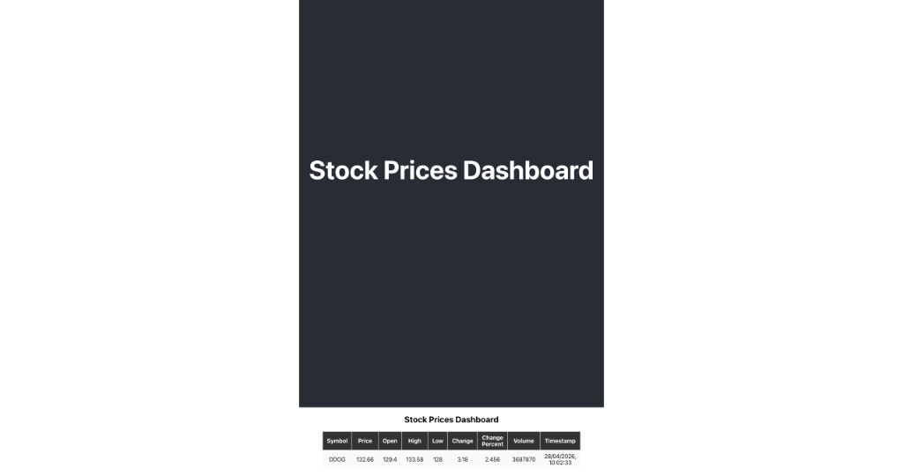
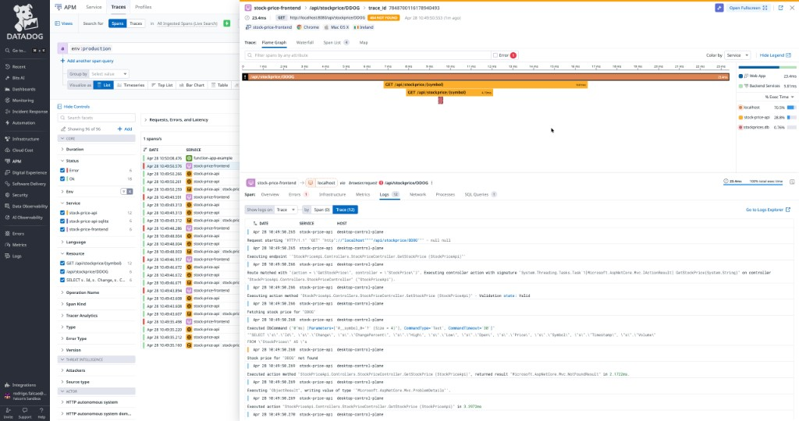

# DD-Stock-Price

Sample **ASP.NET Core** API plus **React** frontend that loads observability data into **Datadog** (logs, APM traces, unified service tagging, optional RUM). A background worker pulls quotes for **DDOG**, **DT**, and **NEWR** from **[Alpha Vantage](#alpha-vantage-how-quotes-work)** and stores them in **SQLite** (`stockprices.db`).

**Stock Prices Dashboard** (React UI preview):



---

## Alpha Vantage: how quotes work

This backend talks to **[Alpha Vantage](https://www.alphavantage.co/)**, a hosted market-data API over HTTPS. Nothing is scraped from brokerage sites—you call an official REST endpoint with **your API key**.

### Request shape (what this repo calls)

For each ticker the background service calls **`GLOBAL_QUOTE`**, effectively:

`/query?function=GLOBAL_QUOTE&symbol=<SYMBOL>&apikey=<YOUR_KEY>`

When the key is valid and within quota, the JSON response includes **`Global Quote`** with fields such as latest price and volume; the worker maps those into the `StockPrices` table and emits DogStatsd metrics (`stock_price.latest`, etc.). If the key is missing, invalid, or over the provider’s quota, Alpha Vantage often returns **`Information`** or **`Note`** text instead—there is no **`Global Quote`**—so the worker records `alphavantage.no_quote` and increments **`stock_price.fetch.error`** (see `reason` tags in Datadog).

Limits depend on Alpha Vantage’s **current** plan (free tiers often impose a strict **daily** request cap). To reduce burn on a tiny cap this repo waits **`AlphaVantage:FetchIntervalHours`** between **full passes** over all symbols (see `appsettings.json`; default **3** hours ⇒ about eight passes × three symbols ⇒ about **24** API calls per day).

### Getting your API key

1. Open **[Alpha Vantage — claim your API key](https://www.alphavantage.co/support/#api-key)** (or start from their site → support / pricing).
2. Complete their sign-up (“Get Your Free API Key Today” flow). They email or display a single **personal API key**.
3. **Do not commit that key.** Treat it like any third-party credential.

### Putting the key where the app reads it

The worker resolves **one shared key** for all symbols (not the legacy per-ticker placeholders), in this order:

1. Environment variable **`ALPHA_VANTAGE_API_KEY`** (recommended in Kubernetes and Docker Compose).
2. Configuration **`AlphaVantage:ApiKey`** (for local overrides; prefer **User Secrets** or env instead of committing values).

**Kubernetes:** `deployment.yaml` includes **`ALPHA_VANTAGE_API_KEY`** with an empty placeholder. For a production-style setup, store the key in a **Secret** and wire the pod to set `ALPHA_VANTAGE_API_KEY` from `secretKeyRef`. Example:

```bash
kubectl create secret generic alphavantage-credentials \
  --from-literal=api-key='YOUR_ALPHA_VANTAGE_KEY' \
  --dry-run=client -o yaml | kubectl apply -f -
```

Point the deployment at that secret’s `api-key` field (same pattern as other app secrets you already use).

**Docker Compose:** add to the `backend` service, for example `ALPHA_VANTAGE_API_KEY: ${ALPHA_VANTAGE_API_KEY}`, and export the variable from your shell or a **local** env file that is not in git.

**Metrics between live fetches:** once rows exist in SQLite, a separate heartbeat job can re-send the **last stored** price as a **`stock_price.latest`** gauge on a timer (**`StockPrice:GaugeHeartbeatMinutes`**), tagged with `channel:database_heartbeat`. That keeps Datadog charts filled without additional Alpha Vantage requests.

---

## What you can do in the app

| Action | How |
|--------|-----|
| Open the UI | Use the URLs below (Docker Compose or Kubernetes). |
| See competitor prices | The UI calls `GET /api/StockPrice/competitors`. |
| Inspect one symbol | `GET /api/StockPrice/{symbol}` (e.g. `DDOG`) returns the latest row or `404` if none yet. |
| Comparisons | `GET /api/StockPrice/compare/{symbol}` returns price deltas over several windows. |

After startup, wait for at least one background fetch cycle (**`AlphaVantage:FetchIntervalHours`**, default **3** hours) or hit the API once data exists; until then, single-symbol GETs may return **404**.

---

## Configure Datadog (do this before expecting telemetry)

Three places must be set up on **your** machine or org. Nothing here contains real keys.

### 1. Docker Compose: agent credentials file

The **`datadog-agent`** service uses an **`env_file`** so the container receives your Datadog **API key** (and any other Agent vars you keep there):

```yaml
# docker-compose.yml (excerpt)
env_file:
  - ~/sandbox.docker.env
```

**You must create that file** (or change the path in `docker-compose.yml` to a file you control). At minimum the Agent expects something equivalent to:

```bash
DD_API_KEY=<your_datadog_api_key>
```

Use the same key style as in [Agent installation](https://docs.datadoghq.com/agent/). Without this file, Compose will fail to start the agent or the agent will not authenticate to Datadog.

### 2. Kubernetes: API key and Helm secrets

The sample **`datadog-values.yaml`** is wired for an **existing Secret** rather than committing a key:

- **`datadog.apiKey`** is left empty.
- **`datadog.apiKeyExistingSecret`** points at a Secret (e.g. `datadog-agent-secrets`) whose data includes the **`api-key`** key.

Create the namespace and Secret before `helm upgrade`, for example (adjust namespace and secret name to match your values file):

```bash
kubectl create namespace datadog   # if you use namespace "datadog"
set -a && source ~/path/to/your.env && set +a   # file containing DD_API_KEY
kubectl create secret generic datadog-agent-secrets -n datadog \
  --from-literal=api-key="$DD_API_KEY" \
  --dry-run=client -o yaml | kubectl apply -f -
```

See the comments at the top of **`datadog-values.yaml`** for the same pattern. You may also need an **app key** for some Cluster Agent features if you enable them; keep those in Secrets, not in git.

### 3. RUM (browser): Datadog UI first, then the frontend

**Real User Monitoring** is **not** enabled by pasting random strings into the repo:

1. In the Datadog app, open **Digital Experience → Browser RUM** (or **UX Monitoring → RUM Applications**) and **create a RUM application** for this site.
2. Copy the **Application ID** and **client token** Datadog shows for that application (and note your **site**, e.g. `datadoghq.com` vs `datadoghq.eu`).
3. Put those values into the frontend in one of these ways:
   - **Recommended:** pass **`REACT_APP_DD_APPLICATION_ID`**, **`REACT_APP_DD_CLIENT_TOKEN`**, **`REACT_APP_DD_SITE`** (and optionally **`REACT_APP_DD_ENV`**, **`REACT_APP_DD_VERSION`**) as **build arguments** when building the Docker image (see **`Dockerfile.frontend`**), or set them in your shell / `.env` before `npm start` for local dev.
   - **Alternatively:** edit the defaults in **`stock-price-frontend/src/index.js`** (they are read from `process.env.REACT_APP_*` with fallbacks). Treat fallbacks as placeholders only; **do not commit real client tokens** to public repos.

Until RUM is configured, the rest of the app still runs; you simply will not see browser sessions in RUM.

---

## Run with Docker Compose (local)

**Prerequisites:** Docker, and the **`env_file`** described in [Docker Compose: agent credentials file](#1-docker-compose-agent-credentials-file) so the Datadog Agent can start.

1. Build and start:

   ```bash
   docker compose build
   docker compose up -d
   ```

2. Open the app:

   - **Frontend:** [http://localhost:3000](http://localhost:3000)
   - **Backend API (direct):** [http://localhost:5261](http://localhost:5261)  
     Example: [http://localhost:5261/api/StockPrice/competitors](http://localhost:5261/api/StockPrice/competitors)

3. The **Datadog agent** container exposes **8126** for APM (`DD_APM_NON_LOCAL_TRAFFIC=true`).

**Compose vs Kubernetes (backend APM):** The backend is built for **Kubernetes Single Step Instrumentation (SSI)**. The Docker image does **not** ship the native CLR profiler; on Compose, `docker-entrypoint.sh` simply starts `dotnet` without injection. Logs and the app still run; **end-to-end .NET APM on Compose** would require either a separate tracer install in the image or reverting to a self-contained tracer bundle for local-only use. For full APM parity, use the Kubernetes path below.

---

## Run on Kubernetes (e.g. Docker Desktop)

**Prerequisites:** `kubectl`, cluster access, **Datadog Agent** installed with Helm using **`datadog-values.yaml`**, and a **Kubernetes Secret** with your API key as described in [Kubernetes: API key and Helm secrets](#2-kubernetes-api-key-and-helm-secrets).

1. Build images locally (tags must match `deployment.yaml`):

   ```bash
   docker build -f Dockerfile.backend -t stockprice-backend:heartbeat-schedule .
   docker build -f Dockerfile.frontend -t stockprice-frontend:prod .
   ```

2. Apply workloads:

   ```bash
   kubectl apply -f deployment.yaml
   ```

3. Open the UI:

   - Frontend `Service` is **LoadBalancer** on port **8080**. On **Docker Desktop**, that is usually [http://localhost:8080](http://localhost:8080).

4. After **backend** code or Dockerfile changes, rebuild and roll the deployment:

   ```bash
   docker build -f Dockerfile.backend -t stockprice-backend:heartbeat-schedule .
   kubectl apply -f deployment.yaml
   kubectl rollout restart deployment/stockprice-backend
   kubectl rollout status deployment/stockprice-backend
   ```

   **Image caching:** With `imagePullPolicy: IfNotPresent`, **Docker Desktop Kubernetes** can keep an **older digest** for the same tag. This repo sets the backend image tag in **`deployment.yaml`** (e.g. `stockprice-backend:heartbeat-schedule`); **bump that tag** whenever you need to force a fresh image locally, or delete the pod after rebuild. In production, prefer a registry with immutable tags or `imagePullPolicy: Always` where appropriate.

---

## Datadog: logs and APM

- **Services:** `stock-price-api` (API), `stock-price-frontend` (UI), plus cluster/agent services.
- **Log Explorer:** filter with `service:stock-price-api`, `source:csharp`, or `env:production` (adjust for your env). Include **Info** as well as **Error** if you expect normal request logs.
- **Custom metrics (stock price):** The API emits **DogStatsd** gauges and counters (e.g. **`stock_price.latest`** in USD with **`company:`** and **`symbol:`** tags, **`stock_price.observation`**, **`stock_price.fetch.attempt`**, **`stock_price.fetch.error`** with **`reason:`**). In Kubernetes, **`deployment.yaml`** sets **`DOGSTATSD_HOST`** / **`DOGSTATSD_PORT`** toward the Datadog Agent Service; ensure the Helm chart exposes **UDP 8125** (see [DogStatsD on Kubernetes](https://docs.datadoghq.com/agent/kubernetes/dogstatsd/)). Docker Compose maps **`8125/udp`** on the agent and sets the same env vars on **`backend`**.

- **Logs ↔ traces:** Use structured JSON logs, `DD_LOGS_INJECTION` / `DD_TRACE_LOGS_INJECTION`, and consistent `DD_ENV` / `DD_SERVICE` / `DD_VERSION`. HTTP requests are traced automatically via **SSI**; there is **no** `Datadog.Trace` NuGet package or manual spans in this app—see `deployment.yaml` and `Startup.cs`.

Screenshot from Datadog **APM** (trace flame graph with frontend → API → DB spans, and **Logs** linked to the same trace—here a `404` when no row exists yet for a symbol):



---

## Observability journey (how this repo ended up here)

This section records the practical path taken to get logs, APM, and correlation working—not only “what to run,” but **what tripped us up** and how it was resolved. No credentials or keys appear here.

### 1. Agent on Kubernetes (Helm)

- The Datadog Agent is deployed with the **official Helm chart**, using `datadog-values.yaml` in this repo as a baseline.
- **APM** is enabled (socket defaults, plus TCP where needed—see below).
- **Single Step Instrumentation** (`datadog.apm.instrumentation.enabled: true`) uses the **Cluster Agent admission controller** to inject init containers and environment so workloads get the correct **language tracer** without baking native binaries into every app image.
- **`libVersions`** (e.g. `dotnet`, `js`) pins or follows release lines. Per [Datadog’s SSI on Kubernetes docs](https://docs.datadoghq.com/tracing/trace_collection/single-step-apm/kubernetes/), if you omit explicit versions, supported languages default to **latest** tracer SDKs—use that deliberately, since major bumps can introduce breaking changes.

### 2. “Tracer still 3.17” while Helm said latest

Two different things were conflated:

- **Admission / SSI** pulls tracer bits from Datadog’s **init images** (`dd-lib-dotnet-init`, etc.). That path can show a **new** canonical tracer version on the pod.
- **`Datadog.Trace.Bundle`** (when we used it) copied a full tree under **`/app/datadog/`** at **publish** time, including `dd-dotnet.sh` with **`TRACER_VERSION`** from the **NuGet** package in the **application image**.

So the UI could show injection metadata for one version while files under `/app/datadog` still reflected an **older publish**. Upgrading “latest” in Helm does **not** rewrite files already baked into an old app image.

**Resolution:** Stop shipping the bundle in the image and rely on **SSI for the native profiler** only—no **`Datadog.Trace`** NuGet dependency. The image does not contain `/app/datadog` from NuGet; **`Dockerfile.backend`** creates `/var/log/datadog/dotnet` for tracer log paths, and **`docker-entrypoint.sh`** just runs `dotnet`; **Kubernetes** sets `CORECLR_*` via injection before the process starts.

### 3. Unix domain socket vs TCP for traces (Docker Desktop)

The admission controller often injects **`DD_TRACE_AGENT_URL`** pointing at a **UDS** path. On **Docker Desktop + .NET**, we saw the managed tracer fail to use that socket reliably (**`EADDRNOTAVAIL`**-style behavior), so traces never reached the Agent.

**Mitigation:** In `deployment.yaml`, the backend explicitly sets **`DD_TRACE_AGENT_URL`** to the in-cluster Agent service over **HTTP**, e.g. `http://datadog.datadog.svc.cluster.local:8126` (adjust namespace/service to match your install). RUM in the browser is unrelated; it talks to Datadog endpoints directly.

Revisit UDS once your environment matches Datadog’s recommended topology if you want to standardize on sockets.

### 4. Logs: stdout JSON and Autodiscovery

- **Serilog** writes **compact JSON** to the console so the Agent can parse fields and correlate with traces.
- Pod annotations under `ad.datadoghq.com/...` configure **Autodiscovery** for logs, checks, and APM flags. Prefer **container stdout** on Kubernetes over relying on file tailing inside ephemeral pods.

### 5. Unified tagging

Deployment and pod labels use **`tags.datadoghq.com/env`**, **`service`**, **`version`** so service catalog and telemetry stay consistent across logs, metrics, and traces.

### 6. Operational checklist after changes

| Change | Typical action |
|--------|----------------|
| Backend C# code | Rebuild image, `kubectl apply -f deployment.yaml`, restart rollout |
| Dockerfile / entrypoint | Same |
| Helm values (SSI, `libVersions`) | `helm upgrade ...` for the Agent release, watch Cluster Agent / admission |
| Stale image on local K8s | New tag or delete pod; see **Same-tag image caching** above |

---

## Repository layout (short)

| Path | Role |
|------|------|
| `StockPriceApi.csproj`, `Program.cs`, `Startup.cs` | .NET 8 API, Serilog JSON to stdout |
| `Services/StockPriceFetcherService.cs` | Background Alpha Vantage fetch (scheduled by `AlphaVantage:FetchIntervalHours`) |
| `Services/StockPriceGaugeHeartbeatService.cs` | Re-sends last SQLite prices as gauges (`database_heartbeat`) |
| `Services/DogStatsdConfigurationService.cs`, `Services/StockQuoteDogStatsdTelemetry.cs` | DogStatsd client + stock price gauges/counters |
| `Dockerfile.backend`, `docker-entrypoint.sh` | Backend image; entrypoint assumes SSI on K8s |
| `deployment.yaml` | Backend, frontend, DB, Services, Datadog-related env and annotations |
| `datadog-values.yaml` | Example Helm values (SSI, APM, ASM flags as configured) |
| `docker-compose.yml` | Local stack with agent, frontend, backend, SQL optional |
| `stock-price-frontend/` | React app served via nginx in production image |
| `stock-price-frontend/src/index.js` | Datadog Browser RUM + Logs init (`REACT_APP_DD_*` or local defaults) |

---

## Security note

- Do **not** commit real **Datadog** API keys, **Alpha Vantage** keys, or other third-party secrets. Use `env_file`, environment variables, or **Kubernetes Secrets**, and rotate any key that has ever appeared in a commit or screenshot.
- Treat competitor-symbol API keys like any other secret: configuration only, never source control.
