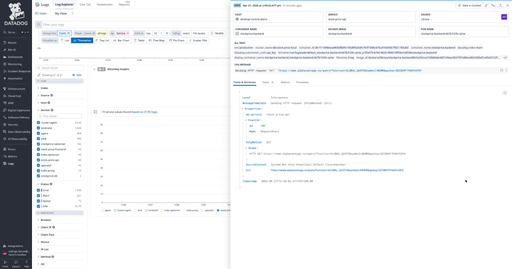

# DD-Stock-Price

Sample **ASP.NET Core** API plus **React** frontend that loads observability data into **Datadog** (logs, APM traces, unified service tagging, optional RUM). A background worker periodically pulls quotes for **DDOG**, **DT**, and **NEWR** from Alpha Vantage and stores them in **SQLite** (`stockprices.db`).

---

## What you can do in the app

| Action | How |
|--------|-----|
| Open the UI | Use the URLs below (Docker Compose or Kubernetes). |
| See competitor prices | The UI calls `GET /api/StockPrice/competitors`. |
| Inspect one symbol | `GET /api/StockPrice/{symbol}` (e.g. `DDOG`) returns the latest row or `404` if none yet. |
| Comparisons | `GET /api/StockPrice/compare/{symbol}` returns price deltas over several windows. |

After startup, wait for at least one background fetch cycle (default **30 minutes**) or hit the API once data exists; until then, single-symbol GETs may return **404**.

---

## Run with Docker Compose (local)

**Prerequisites:** Docker, and an env file (this repo’s `docker-compose.yml` references `~/sandbox.docker.env`) with your **Datadog API key** for the agent. Adjust the path or use another secret mechanism if you prefer.

1. Build and start:

   ```bash
   docker compose build
   docker compose up -d
   ```

2. Open the app:

   - **Frontend:** [http://localhost:3000](http://localhost:3000)
   - **Backend API (direct):** [http://localhost:5261](http://localhost:5261)  
     Example: [http://localhost:5261/api/StockPrice/competitors](http://localhost:5261/api/StockPrice/competitors)

3. The **Datadog agent** container exposes **8126** for APM (`DD_APM_NON_LOCAL_TRAFFIC=true`).

**Compose vs Kubernetes (backend APM):** The backend is built for **Kubernetes Single Step Instrumentation (SSI)**. The Docker image does **not** ship the native CLR profiler; on Compose, `docker-entrypoint.sh` simply starts `dotnet` without injection. Logs and the app still run; **end-to-end .NET APM on Compose** would require either a separate tracer install in the image or reverting to a self-contained tracer bundle for local-only use. For full APM parity, use the Kubernetes path below.

---

## Run on Kubernetes (e.g. Docker Desktop)

**Prerequisites:** `kubectl`, cluster access, **Datadog Agent** installed (Helm + `datadog-values.yaml` in this repo), API key supplied via a **Secret** (for example the chart’s expected secret name for your environment).

1. Build images locally (tags must match `deployment.yaml`):

   ```bash
   docker build -f Dockerfile.backend -t stockprice-backend:jsonlog .
   docker build -f Dockerfile.frontend -t stockprice-frontend:prod .
   ```

2. Apply workloads:

   ```bash
   kubectl apply -f deployment.yaml
   ```

3. Open the UI:

   - Frontend `Service` is **LoadBalancer** on port **8080**. On **Docker Desktop**, that is usually [http://localhost:8080](http://localhost:8080).

4. After **backend** code or Dockerfile changes, rebuild and roll the deployment:

   ```bash
   docker build -f Dockerfile.backend -t stockprice-backend:jsonlog .
   kubectl rollout restart deployment/stockprice-backend
   kubectl rollout status deployment/stockprice-backend
   ```

   **Same-tag image caching:** With `imagePullPolicy: IfNotPresent`, **Docker Desktop Kubernetes** can keep running an **older digest** for `stockprice-backend:jsonlog` even after you rebuild locally. If behavior or tracer files look stale, delete the pod (`kubectl delete pod -l app=stockprice-backend`) or use a **new tag** in the manifest and rebuild with that tag. In production, prefer a registry with immutable tags or `imagePullPolicy: Always` where appropriate.

---

## Datadog: logs and APM

- **Services:** `stock-price-api` (API), `stock-price-frontend` (UI), plus cluster/agent services.
- **Log Explorer:** filter with `service:stock-price-api`, `source:csharp`, or `env:production` (adjust for your env). Include **Info** as well as **Error** if you expect normal request logs.
- **Logs ↔ traces:** Use structured JSON logs, `DD_LOGS_INJECTION` / `DD_TRACE_LOGS_INJECTION`, consistent `DD_ENV` / `DD_SERVICE` / `DD_VERSION`, and (for background work) **active spans** around work you want tied to traces—see `deployment.yaml`, `Startup.cs`, and `Services/StockPriceFetcherService.cs`.

Screenshot from Datadog **Log Explorer** (structured `stock-price-api` log with service, cluster, and trace-friendly fields):



---

## Observability journey (how this repo ended up here)

This section records the practical path taken to get logs, APM, and correlation working—not only “what to run,” but **what tripped us up** and how it was resolved. No credentials or keys appear here.

### 1. Agent on Kubernetes (Helm)

- The Datadog Agent is deployed with the **official Helm chart**, using `datadog-values.yaml` in this repo as a baseline.
- **APM** is enabled (socket defaults, plus TCP where needed—see below).
- **Single Step Instrumentation** (`datadog.apm.instrumentation.enabled: true`) uses the **Cluster Agent admission controller** to inject init containers and environment so workloads get the correct **language tracer** without baking native binaries into every app image.
- **`libVersions`** (e.g. `dotnet`, `js`) pins or follows release lines. Per [Datadog’s SSI on Kubernetes docs](https://docs.datadoghq.com/tracing/trace_collection/single-step-apm/kubernetes/), if you omit explicit versions, supported languages default to **latest** tracer SDKs—use that deliberately, since major bumps can introduce breaking changes.

### 2. “Tracer still 3.17” while Helm said latest

Two different things were conflated:

- **Admission / SSI** pulls tracer bits from Datadog’s **init images** (`dd-lib-dotnet-init`, etc.). That path can show a **new** canonical tracer version on the pod.
- **`Datadog.Trace.Bundle`** (when we used it) copied a full tree under **`/app/datadog/`** at **publish** time, including `dd-dotnet.sh` with **`TRACER_VERSION`** from the **NuGet** package in the **application image**.

So the UI could show injection metadata for one version while files under `/app/datadog` still reflected an **older publish**. Upgrading “latest” in Helm does **not** rewrite files already baked into an old app image.

**Resolution:** Stop shipping the bundle in the image and rely on **SSI for the native profiler**, while keeping the **`Datadog.Trace`** NuGet package only for **managed APIs** (e.g. `Tracer.Instance.StartActive` in the background fetcher). The image no longer contains `/app/datadog` from NuGet; **`Dockerfile.backend`** creates `/var/log/datadog/dotnet` for tracer log paths, and **`docker-entrypoint.sh`** just runs `dotnet`; **Kubernetes** sets `CORECLR_*` via injection before the process starts.

Align the **`Datadog.Trace`** package version (major/minor) with the tracer line your cluster injects when you care about custom spans and profiler compatibility.

### 3. Unix domain socket vs TCP for traces (Docker Desktop)

The admission controller often injects **`DD_TRACE_AGENT_URL`** pointing at a **UDS** path. On **Docker Desktop + .NET**, we saw the managed tracer fail to use that socket reliably (**`EADDRNOTAVAIL`**-style behavior), so traces never reached the Agent.

**Mitigation:** In `deployment.yaml`, the backend explicitly sets **`DD_TRACE_AGENT_URL`** to the in-cluster Agent service over **HTTP**, e.g. `http://datadog.datadog.svc.cluster.local:8126` (adjust namespace/service to match your install). RUM in the browser is unrelated; it talks to Datadog endpoints directly.

Revisit UDS once your environment matches Datadog’s recommended topology if you want to standardize on sockets.

### 4. Logs: stdout JSON and Autodiscovery

- **Serilog** writes **compact JSON** to the console so the Agent can parse fields and correlate with traces.
- Pod annotations under `ad.datadoghq.com/...` configure **Autodiscovery** for logs, checks, and APM flags. Prefer **container stdout** on Kubernetes over relying on file tailing inside ephemeral pods.

### 5. Unified tagging

Deployment and pod labels use **`tags.datadoghq.com/env`**, **`service`**, **`version`** so service catalog and telemetry stay consistent across logs, metrics, and traces.

### 6. Operational checklist after changes

| Change | Typical action |
|--------|----------------|
| C# code or NuGet | Rebuild image, `kubectl rollout restart deployment/stockprice-backend` |
| Dockerfile / entrypoint | Same |
| Helm values (SSI, `libVersions`) | `helm upgrade ...` for the Agent release, watch Cluster Agent / admission |
| Stale image on local K8s | New tag or delete pod; see **Same-tag image caching** above |

---

## Repository layout (short)

| Path | Role |
|------|------|
| `StockPriceApi.csproj`, `Program.cs`, `Startup.cs` | .NET 8 API, Serilog JSON to stdout |
| `Services/StockPriceFetcherService.cs` | Background fetch; custom Datadog spans via `Datadog.Trace` |
| `Dockerfile.backend`, `docker-entrypoint.sh` | Backend image; entrypoint assumes SSI on K8s |
| `deployment.yaml` | Backend, frontend, DB, Services, Datadog-related env and annotations |
| `datadog-values.yaml` | Example Helm values (SSI, APM, ASM flags as configured) |
| `docker-compose.yml` | Local stack with agent, frontend, backend, SQL optional |
| `stock-price-frontend/` | React app served via nginx in production image |

---

## Security note

- Do **not** commit real **Datadog** API keys, **Alpha Vantage** keys, or other third-party secrets. Use `env_file`, environment variables, or **Kubernetes Secrets**, and rotate any key that has ever appeared in a commit or screenshot.
- Treat competitor-symbol API keys like any other secret: configuration only, never source control.
